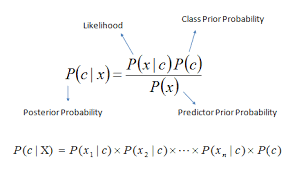

# Naive Bayes Classifiers

The file `naivebayes.py` contanins the implementation Guassian Naive Bayes Classifier

To make it much more simple I have restricted the input domain only to numpy arrays.



## Gaussian Naive Bayes

The formula is used compute the posterior probability, in Guassian Naive Bayes for calculating the Likelihood we use the normal uni/multivariate distribution(depending on the features)

```python3
self.n_features_ # Number of features

self.n_classes_ # Number of classes

self.class_mean_ # Contains the class mean's

self.class_std_ # Contains the class standard deviation's

self.prior_proba_ # Prior Probabilities of each class

self.class_encoding_ # Contains Class encodings
```

### Example using Iris dataset

```ipython
In [1]: import pandas as pd                                            

In [2]: from naivebayes import GaussianNB                              

In [3]: from sklearn.model_selection import train_test_split           

In [4]: data = pd.read_csv('Iris.csv', index_col='Id')

In [5]: train_X, test_X, train_y, test_y = train_test_split(data.loc[:, data.columns != 'Species'], data['Species'], test_size=0.2)            

In [6]: clf = GaussianNB()

In [7]: clf.fit(train_X.values, train_y.values)                                                                                               

In [8]: clf.predict(test_X.values)
Out[8]: array([2, 2, 0, 1, 1, 2, 0, 0, 0, 2, 0, 2, 1, 1, 2, 1, 1, 0, 1, 1, 2, 0, 0, 2, 1, 0, 2, 0, 0, 0])

In [9]: clf.evaluate(train_X.values, train_y.values) # R^2 score on training data         
Out[9]: 0.9248747913188647

In [10]: clf.evaluate(test_X.values, test_y.values) # R^2 score on testing data             
Out[10]: 0.9486301369863014
```

> Change the data reading according to your dataset file.